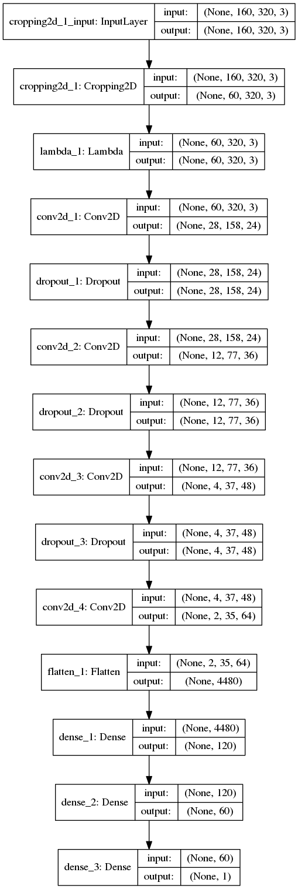
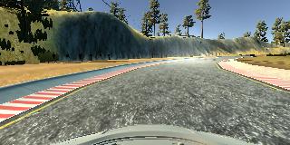
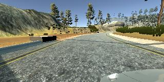
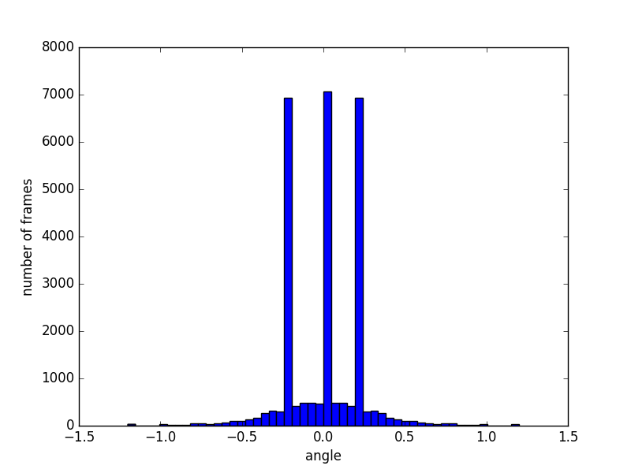
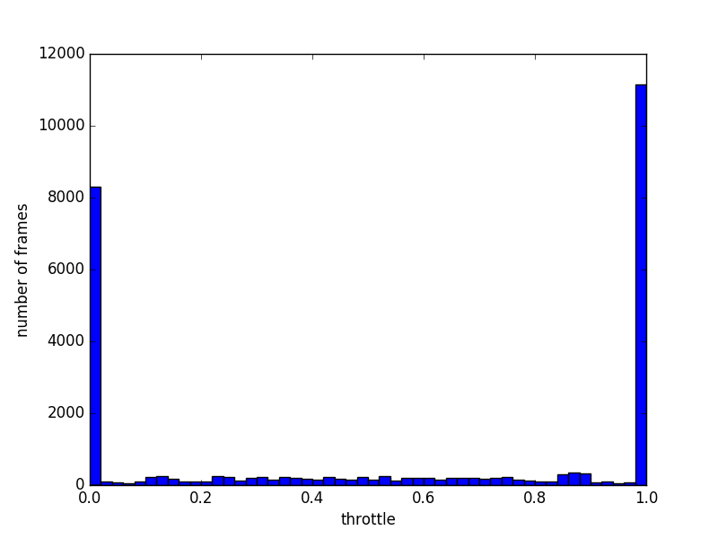
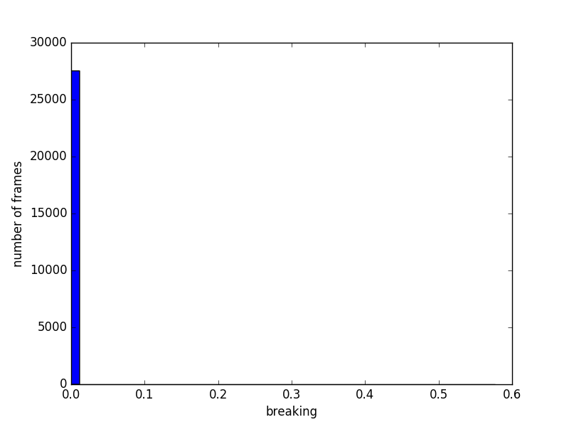
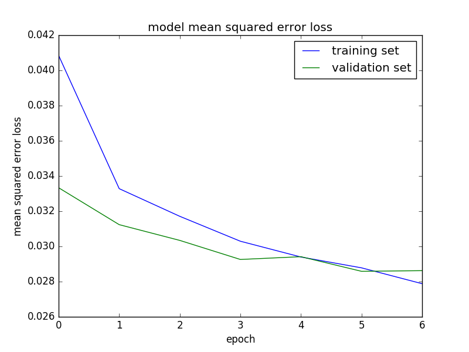

#**Behavioral Cloning** 

##Writeup Template

---

**Behavioral Cloning Project**

The goals / steps of this project are the following:

* Use the simulator to collect data of good driving behavior
* Build, a convolution neural network in Keras that predicts steering angles from images
* Train and validate the model with a training and validation set
* Test that the model successfully drives around track one without leaving the road
* Summarize the results with a written report


[//]: # (Image References)

[image1]: ./examples/placeholder.png "Model Visualization"
[image2]: ./examples/placeholder.png "Grayscaling"
[image6]: ./examples/placeholder_small.png "Normal Image"
[image7]: ./examples/placeholder_small.png "Flipped Image"

## Rubric Points
###Here I will consider the [rubric points](https://review.udacity.com/#!/rubrics/432/view) individually and describe how I addressed each point in my implementation.  

---
###Files Submitted & Code Quality

####1. Submission includes all required files and can be used to run the simulator in autonomous mode

My project includes the following files:

* model.py containing the script to create and train the model
* drive.py for driving the car in autonomous mode
* model.h5 containing a trained convolution neural network 
* writeup_report.md and writeup_report.pdf summarizing the results

####2. Submission includes functional code
Using the Udacity provided simulator and my drive.py file, the car can be driven autonomously around the track by executing 
```sh
python drive.py model.h5
```

####3. Submission code is usable and readable

The model.py file contains the code for training and saving the convolution neural network. 
The file shows the pipeline I used for training and validating the model, 
and it contains comments to explain how the code works.

###Model Architecture and Training Strategy

####1. An appropriate model architecture has been employed

My model consists of a convolution neural network with 5x5 and 3x3 filter sizes 
and depths between 24 and 64 (model.py lines 53-67) 
as suggest in the paper 
["End to End Learning for Self-Driving Cars"](http://images.nvidia.com/content/tegra/automotive/images/2016/solutions/pdf/end-to-end-dl-using-px.pdf).

The data is cropped at top and bottom to a 60 pixels window at line 54 using 
Keras `Cropping2D` layer with `cropping=((75,25), (0,0))`
and normalized in the model using a Keras lambda layer (code line 55). 

The model includes RELU layers to introduce nonlinearity (parameter `activation="relu"` of `Conv2D` layers).

####2. Attempts to reduce overfitting in the model

The model contains dropout layers in order to reduce overfitting (model.py lines 57,59,61). 

The model was trained and validated on different data sets to ensure that the model 
was not overfitting (code line 10-28). The model was tested by running it through 
the simulator and ensuring that the vehicle could stay on the track.

####3. Model parameter tuning

The model used an adam optimizer, so the learning rate was not tuned manually (model.py line 67).

####4. Appropriate training data

Training data was chosen to keep the vehicle driving on the road. 
I used a combination of center lane driving, recovering from the left and right sides of the road,
opposite driving and driving the second track.

For details about how I created the training data, see the next section. 

###Model Architecture and Training Strategy

####1. Solution Design Approach

The overall strategy for deriving a model architecture was to use convolution
layers followed by some fully connected layers with the final scalar value.

My first step was to use a convolution neural network model similar to the one presented 
in the paper "End to End Learning for Self-Driving Cars".

In order to gauge how well the model was working, I split my image and steering angle data into a training 
and validation set. I found that my first model had a low mean squared error on the training set but a high 
mean squared error on the validation set. This implied that the model was overfitting. 

To combat the overfitting, I modified the model so that includes dropout layers.

Then I tried to use more data frames, but hit the memory limit that was reported by tensorflow
```
W tensorflow/core/common_runtime/bfc_allocator.cc:217] Ran out of memory trying to allocate 1.18GiB. 
The caller indicates that this is not a failure, but may mean that there could be performance gains if more memory is available.
W tensorflow/core/common_runtime/bfc_allocator.cc:217] Ran out of memory trying to allocate 1.56GiB. 
The caller indicates that this is not a failure, but may mean that there could be performance gains if more memory is available.
W tensorflow/core/common_runtime/bfc_allocator.cc:217] Ran out of memory trying to allocate 1.92GiB.
The caller indicates that this is not a failure, but may mean that there could be performance gains if more memory is available.
```

To allow bigger datasets I used generators to keep only a batch part of images in memory
in lines 30-42.

The final step was to run the simulator to see how well the car was driving around track one. 
There were a few spots where the vehicle fell off the track to improve the driving behavior in these cases, I 
created more datasets with different driving behavior.

At the end of the process, the vehicle is able to drive autonomously around the track without leaving the road.

####2. Final Model Architecture

The final model architecture (model.py lines 18-24) consisted of a convolution neural network with the following layers and layer sizes

| Layer         		          |     Description	        					                 |
|:-------------------------------:|:------------------------------------------------------------:|
| Input         		          | 160x320x3 RGB image   						                 |
| Cropping2D      		          | Crops top 75 and bottom 25 pixels, output 60x320x3 RGB image |
| Lambda      		              | Scales and transforms image values to [-0.5,0.5] range       |
| Convolution 5x5     	          | 2x2 stride, valid padding, outputs 56x316x24 	             |
| RELU					          |												                 |
| Dropout	      	              | Dropout with probability 0.25 				                 |
| Convolution 5x5	              | 2x2 stride, valid padding, outputs 24x154x36                 |
| RELU					          |												                 |
| Dropout	      	              | Dropout with probability 0.25 				                 |
| Convolution 5x5	              | 2x2 stride, valid padding, outputs 8x73x48                   |
| RELU					          |												                 |
| Dropout	      	              | Dropout with probability 0.25 				                 |
| Convolution 3x3	              | 1x1 stride, valid padding, outputs 2x35x64                   |
| RELU					          |												                 |
| Flatten                         | Flat vector 2* 35 * 64=4480                                  |
| Fully connected		          | Input = 4480, output = 120                                   |
| Fully connected		          | Input = 120, output = 60                                     |
| Fully connected		          | Input = 60, output = 1                                       |

Here is a visualization of the architecture




####3. Creation of the Training Set & Training Process

To capture good driving behavior, I first recorded two laps on track one using center lane driving. 
Here is an example image of center lane driving:


I then recorded the vehicle recovering from the left side and right sides of the road back to center so that the vehicle would learn to 
recover from off road driving.


Then I repeated this process on track two in order to get more data points.

To augment the data sat, I also flipped images and angles thinking that this would 
For example, here is an image that has then been flipped:





Also I collected some data running in opposite direction


and one track for the second track 


After the collection process, I had 13738 frames in 7 data sets, 
so i can easily try different combinations of data sets.

| Number of frames | Data set CSV file name |
|:-----:|:---------------------------------:|
|  2567 | `./data/driving_log.csv`          |
|  3950 | `./data1/driving_log.csv`         |
|  1645 | `./data2/driving_log.csv`         |
|  2055 | `./data3/driving_log.csv`         |
|   690 | `./data_rev/driving_log.csv`      |
|  1067 | `./data_out/driving_log.csv`      |
|  1764 | `./data_track2/driving_log.csv`   |

I had observed that training model with offroad, reverse and the second track data sets
makes the model very sensitive to road sides and the model tends to drive off road.

In the final training of the model I used only the data sets `data` and `data3`
where I tried to keep model at the center line, but in the first data set
I used zero throttle and the second set I used full throttle in all sharp turns,
so the training data set has 4622 frames.

Before model training I have augmented data set by frames from the left and the right
cameras with the additive angle correction 0.2 on line 18
and mirrored the data set in lines 23-26. Later the boolean flag used to flip image by OpenCV `cv2.flip` function.

The data histograms for angle, throttle and breaking





show that the angles are symmetric with respect to 0 with mainly 3 preferable angles -0.25, 0 and 0.25.
During training i used almost always either full throttle or zero throttle and no breaking.

I finally randomly shuffled the data set and put 20% of the data into a validation set on line 91.

I used this training data for training the model in batches of size by creating a generator on line 92.
The validation set helped determine if the model was over or under fitting and created as a generator function on line 93.
The optimal number of epochs was 7 as evidenced by the training error graph



where the validation error is not decreasing any more at the value 0.0286.

I used an Adam optimizer so that manually training the learning rate wasn't necessary.

The training output log is
```
python3 model.py 
Using TensorFlow backend.
I tensorflow/stream_executor/dso_loader.cc:135] successfully opened CUDA library libcublas.so.8.0 locally
I tensorflow/stream_executor/dso_loader.cc:135] successfully opened CUDA library libcudnn.so.5 locally
I tensorflow/stream_executor/dso_loader.cc:135] successfully opened CUDA library libcufft.so.8.0 locally
I tensorflow/stream_executor/dso_loader.cc:135] successfully opened CUDA library libcuda.so.1 locally
I tensorflow/stream_executor/dso_loader.cc:135] successfully opened CUDA library libcurand.so.8.0 locally
Epoch 1/7
W tensorflow/core/platform/cpu_feature_guard.cc:45] The TensorFlow library wasn't compiled to use SSE3 instructions, 
but these are available on your machine and could speed up CPU computations.
W tensorflow/core/platform/cpu_feature_guard.cc:45] The TensorFlow library wasn't compiled to use SSE4.1 instructions, 
but these are available on your machine and could speed up CPU computations.
W tensorflow/core/platform/cpu_feature_guard.cc:45] The TensorFlow library wasn't compiled to use SSE4.2 instructions, 
but these are available on your machine and could speed up CPU computations.
W tensorflow/core/platform/cpu_feature_guard.cc:45] The TensorFlow library wasn't compiled to use AVX instructions, 
but these are available on your machine and could speed up CPU computations.
W tensorflow/core/platform/cpu_feature_guard.cc:45] The TensorFlow library wasn't compiled to use AVX2 instructions, 
but these are available on your machine and could speed up CPU computations.
W tensorflow/core/platform/cpu_feature_guard.cc:45] The TensorFlow library wasn't compiled to use FMA instructions, 
but these are available on your machine and could speed up CPU computations.
I tensorflow/stream_executor/cuda/cuda_gpu_executor.cc:910] successful NUMA node read from SysFS had negative value (-1), 
but there must be at least one NUMA node, so returning NUMA node zero
I tensorflow/core/common_runtime/gpu/gpu_device.cc:885] Found device 0 with properties: 
name: GeForce 940MX
major: 5 minor: 0 memoryClockRate (GHz) 1.2415
pciBusID 0000:01:00.0
Total memory: 1.96GiB
Free memory: 1.60GiB
I tensorflow/core/common_runtime/gpu/gpu_device.cc:906] DMA: 0 
I tensorflow/core/common_runtime/gpu/gpu_device.cc:916] 0:   Y 
I tensorflow/core/common_runtime/gpu/gpu_device.cc:975] Creating TensorFlow device (/gpu:0) -> 
(device: 0, name: GeForce 940MX, pci bus id: 0000:01:00.0)
347/346 [==============================] - 102s - loss: 0.0408 - val_loss: 0.0333
Epoch 2/7
347/346 [==============================] - 100s - loss: 0.0333 - val_loss: 0.0312
Epoch 3/7
347/346 [==============================] - 98s - loss: 0.0317 - val_loss: 0.0303
Epoch 4/7
347/346 [==============================] - 98s - loss: 0.0303 - val_loss: 0.0293
Epoch 5/7
347/346 [==============================] - 98s - loss: 0.0294 - val_loss: 0.0294
Epoch 6/7
347/346 [==============================] - 98s - loss: 0.0288 - val_loss: 0.0286
Epoch 7/7
347/346 [==============================] - 101s - loss: 0.0279 - val_loss: 0.0286
```


The video file `video.mp4` shows one lap of the model run. It shows that the car is over-controlled
without the throttle control but the car stays on the road for the first track. The second track
requires more detailed model with the throttle and breaks control to keep the car on the road
on sharp turns.
 
